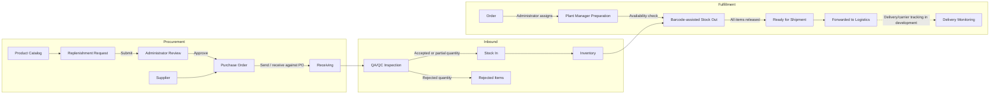
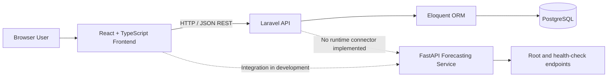

# SmartChain

> **SmartChain: An Integrated Smart Warehousing and Supply Chain Management System with AI-Based Demand Forecasting and Shipment Reports for E-Commerce**

SmartChain is a fourth-year Bachelor of Science in Information Technology (BSIT) capstone project for coordinating warehouse and supply-chain operations. It brings product, inventory, procurement, receiving, quality assurance, order fulfillment, and shipment records into role-specific workspaces for administrators, plant managers, and QA/QC supervisors.

The system is intended to improve stock visibility, formalize approval and receiving workflows, and provide operational reporting for e-commerce fulfillment. A separate forecasting service and forecasting interfaces are present to support future demand planning; their application integration and prediction logic are still in development.

> **Project stage:** SmartChain is an academic capstone project under active development and testing. It is not presented as a production-ready commercial platform.

## Key Features

- Role-specific dashboards and protected frontend routes for three operational roles
- Product catalog, supplier records, warehouse location, and inventory management
- Replenishment requests with submission and administrator approval or rejection
- Purchase-order creation, supplier assignment, sending, and receiving linkage
- Receiving records and QA/QC inspection with accepted, rejected, and partial outcomes
- Stock-in of inspected quantities and inventory updates
- Assigned-order workflow with availability checks and barcode-assisted stock-out
- Shipment handoff to logistics and operational shipment listings
- Administrative, plant-manager, and QA reporting views
- Persistent light and dark themes
- Demand-forecasting interfaces and a FastAPI service scaffold, with integration pending

The standalone Administrator Barcode Center currently uses local mock data. Operational barcode validation and scanning are implemented in the Plant Manager Stock Out workflow.

## Core Modules

| Module | Description | Status |
| --- | --- | --- |
| Product Catalog | Maintains product identity, SKU, pricing, categorization, and catalog metadata. | Implemented |
| Inventory | Tracks warehouse stock, availability, reservations, backload, status, and barcode information. | Implemented |
| Warehouse | Exposes warehouse details, capacity metrics, and administrator-managed main-location information. | Implemented |
| Procurement | Supports plant-manager replenishment drafts/submission and administrator review decisions. | Implemented |
| Purchase Orders | Creates purchase orders from approved replenishment requests, assigns suppliers, and records sending. | Partially Implemented |
| Suppliers | Maintains supplier details and active/inactive status for purchasing. | Implemented |
| Receiving | Records deliveries against purchase orders and sends received items into QA review. | Implemented |
| Quality Inspection | Records item-level inspection results, accepted/rejected quantities, and QA history/reports. | Implemented |
| Stock In | Adds QA-approved quantities to warehouse inventory and records stock-in completion. | Implemented |
| Stock Out | Validates assigned orders and barcodes, decrements inventory, and records release transactions. | Implemented |
| Orders | Supports administrator order creation/assignment and plant-manager fulfillment transitions. | Implemented |
| Shipments / Logistics | Moves stock-out-complete orders to logistics and lists shipment records; carrier and delivery tracking actions remain incomplete. | Partially Implemented |
| Reports | Provides operational dashboards, report views, and generated datasets; some AI-related values remain placeholders. | Partially Implemented |
| AI Forecasting | Provides forecast UI prototypes and a FastAPI health-check scaffold, but no prediction endpoint or connected forecasting implementation. | Integration Pending |

## System Workflow



Purchase-order and receiving records are linked in the data model and APIs. One purchase-order status update in the current implementation uses a value that differs from the replenishment model's documented status constants, so that transition needs additional integration testing.

## User Roles

- **Administrator (`ADMIN`)** — manages the product catalog, inventory administration, warehouse location, procurement decisions, purchase orders, suppliers, orders, logistics views, users, and administrative reports.
- **Plant Manager (`PLANT_MANAGER`)** — works within an assigned warehouse/branch context to request replenishment, process assigned orders, receive goods, stock approved goods in or release goods out, forward completed orders to logistics, and view plant reports.
- **QA/QC Supervisor (`QA_SUPERVISOR`)** — performs warehouse-scoped quality inspections and reviews inspection history, rejected items, quality reports, and permitted inventory information.

Frontend route guards separate the three workspaces. Backend access is additionally enforced through Sanctum authentication plus policies or controller-level role and warehouse checks. Because some API routes share an authentication group and enforce roles inside controllers, backend authorization—not the frontend guard—is the security boundary.

## Role / Module Access

“Scoped” means access is restricted to the user's assigned warehouse, branch, or records.

| Module | Administrator | Plant Manager | QA/QC Supervisor |
| --- | :---: | :---: | :---: |
| Product Catalog | Manage | Options / view | — |
| Inventory | Manage | Scoped view | Scoped view |
| Warehouse | Manage location | Scoped view | — |
| Procurement | Review | Create / submit own | — |
| Purchase Orders | Manage | Approved list for receiving | — |
| Suppliers | Manage | — | — |
| Receiving | — | Scoped manage | Inspection input |
| Quality Inspection | — | — | Scoped manage |
| Stock In / Stock Out | — | Scoped manage | — |
| Orders | Create / assign / manage | Scoped fulfillment | — |
| Shipments / Logistics | View | Scoped handoff | — |
| Reports | Administrative | Plant operations | Quality reports |
| AI Forecasting | Prototype UI | Prototype UI | — |

## Technology Stack

### Frontend

- React 19, TypeScript 6, Vite 8, and Tailwind CSS 4
- React Router 7, Axios, and TanStack React Query
- Recharts, Lucide React, and ZXing Browser

### Backend

- PHP 8.3 and Laravel 13
- Eloquent ORM and JSON REST API controllers
- PHPUnit feature and unit tests

### Database

- PostgreSQL is configured in `backend/.env.example`; Laravel also retains framework-level SQLite configuration for testing or local alternatives.

### AI / Forecasting

- Python service built with FastAPI and Uvicorn
- The manifest includes pandas, NumPy, SciPy, scikit-learn, and joblib
- The current service code does not yet import these data-science packages or implement a forecasting model

### Authentication / Security

- Laravel Sanctum personal access tokens
- Protected API routes and role-specific frontend routes
- Policies plus controller-level role, branch, and warehouse checks
- Server-side validation and login rate limiting

## System Architecture



The frontend currently targets the Laravel API at `http://localhost:8000/api`. No Laravel HTTP client or frontend API client currently connects to the forecasting service.

## AI-Based Demand Forecasting

The `forecasting-service/` directory is intended to isolate demand forecasting from the Laravel application. Its current FastAPI application exposes:

- `GET /` — service status response
- `GET /health` — health-check response
- `/docs` — FastAPI's generated interactive documentation while running

There is currently no forecast/predict endpoint, training pipeline, persisted model, input schema, or forecast output schema. The administrator and plant-manager forecast pages use static mock datasets, while dashboard “forecast” values are explicitly placeholder calculations derived from recent stock-out activity. Model choice, accuracy, retraining, and production inference are therefore not established capabilities.

The Python dependency manifest indicates the planned numerical and machine-learning toolset, but its scikit-learn version pin should be validated because the recorded version string is not a standard release identifier.

## Security

Verified controls include:

- Sanctum bearer-token authentication and current-token revocation at logout
- Rate limiting after repeated failed login attempts
- Rejection of pending or suspended accounts
- Role-aware policies for users, inventory, orders, and replenishment requests
- Controller-level administrator, plant-manager, and QA restrictions
- Warehouse/branch scoping for relevant operational data
- Laravel validation for payloads and workflow transitions

Frontend guards improve navigation, but sensitive authorization is enforced by Laravel. Never commit populated `.env` files, tokens, credentials, or generated secrets.

## Project Structure

```text
Smartchain/
├── backend/                 # Laravel API, models, policies, migrations, and tests
├── frontend/                # React/TypeScript role-based web application
├── forecasting-service/     # FastAPI service scaffold and Python dependencies
├── docs/                    # Architecture artifacts and implementation notes
└── README.md                # Project documentation
```

## Local Development

### Prerequisites

- PHP 8.3, Composer, Node.js/npm, PostgreSQL, and Python/pip

### Backend Setup

```bash
cd backend
composer install
```

Create a local environment file:

```bash
# macOS / Linux
cp .env.example .env

# Windows PowerShell
Copy-Item .env.example .env
```

Configure your own database values in `.env`, then run:

```bash
php artisan key:generate
php artisan migrate
php artisan serve
```

The default development API address is `http://localhost:8000`. Seeders exist for development data; review them before optionally running `php artisan db:seed`.

### Frontend Setup

```bash
cd frontend
npm install
npm run dev
```

Available scripts are `npm run dev`, `npm run build`, `npm run lint`, and `npm run preview`.

### Forecasting Service Setup

```bash
cd forecasting-service
python -m venv .venv
```

Activate the environment for your platform, then install and run:

```bash
python -m pip install -r requirements.txt
python -m uvicorn app.main:app --reload --port 8001
```

The requirements file currently contains a scikit-learn pin that may need correction before installation succeeds. The service is independently runnable for health checks but is not connected to SmartChain.

## API & Services

The authenticated Laravel API groups endpoints around:

- Authentication and user/role reference data
- Products, warehouses, inventory, and inventory movement
- Procurement requests, purchase orders, and suppliers
- Receiving, QA inspections, rejected items, and quality reports
- Stock in, assigned orders, barcode-assisted stock out, and logistics handoff
- Administrator and plant-manager dashboards and reports

All application endpoints except login are behind `auth:sanctum`; controllers and policies apply role and data-scope rules.

## Testing and Quality Checks

Backend feature tests cover authorization, login throttling, product catalog, inventory, warehouse visibility, procurement, receiving, QA, stock in/out, orders, and reports.

```bash
cd backend
composer test

cd ../frontend
npm run lint
npm run build
```

These are the repository's available checks; passing status is not claimed here.

## Screenshots

### Administrator Dashboard

<!-- Add Administrator Dashboard screenshot here -->

### Plant Manager Dashboard

<!-- Add Plant Manager Dashboard screenshot here -->

### QA/QC Supervisor Dashboard

<!-- Add QA/QC Supervisor Dashboard screenshot here -->

## Project Status

**Under Active Development / Testing**

SmartChain is being developed as a fourth-year BSIT capstone project. The core warehouse workflow is substantially represented in the Laravel API, React interfaces, migrations, and feature tests. Shipment lifecycle completion, forecasting implementation/integration, and remaining mock-driven interfaces require further development and end-to-end testing.

## Contributors

**SmartChain Capstone Team**

## Disclaimer

SmartChain is an academic capstone project currently under development and testing. Features, integrations, workflows, and deployment configuration may change as development continues.
